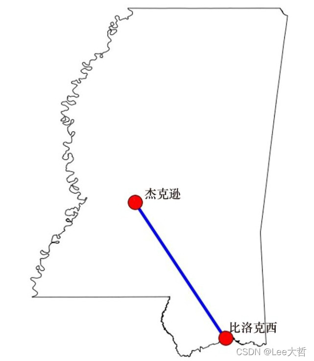
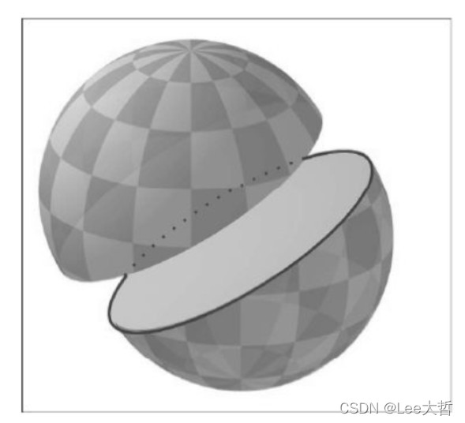
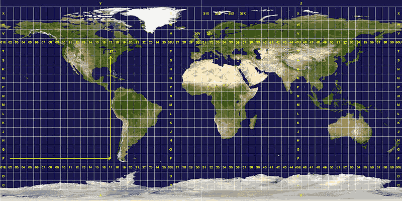
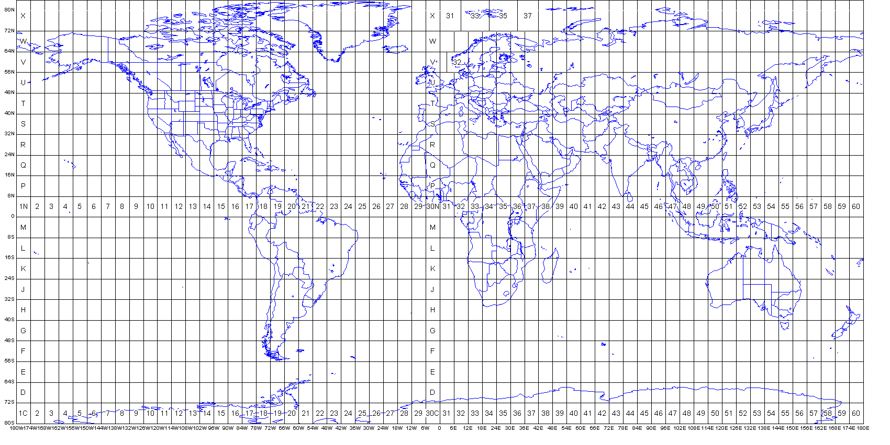
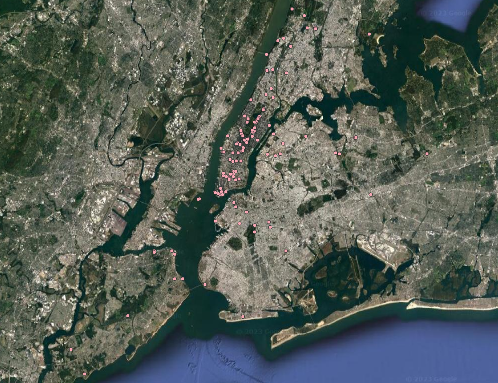
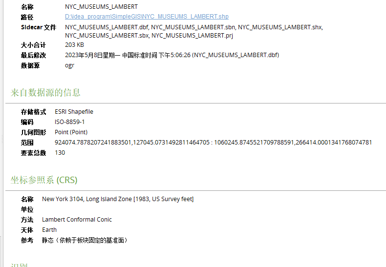
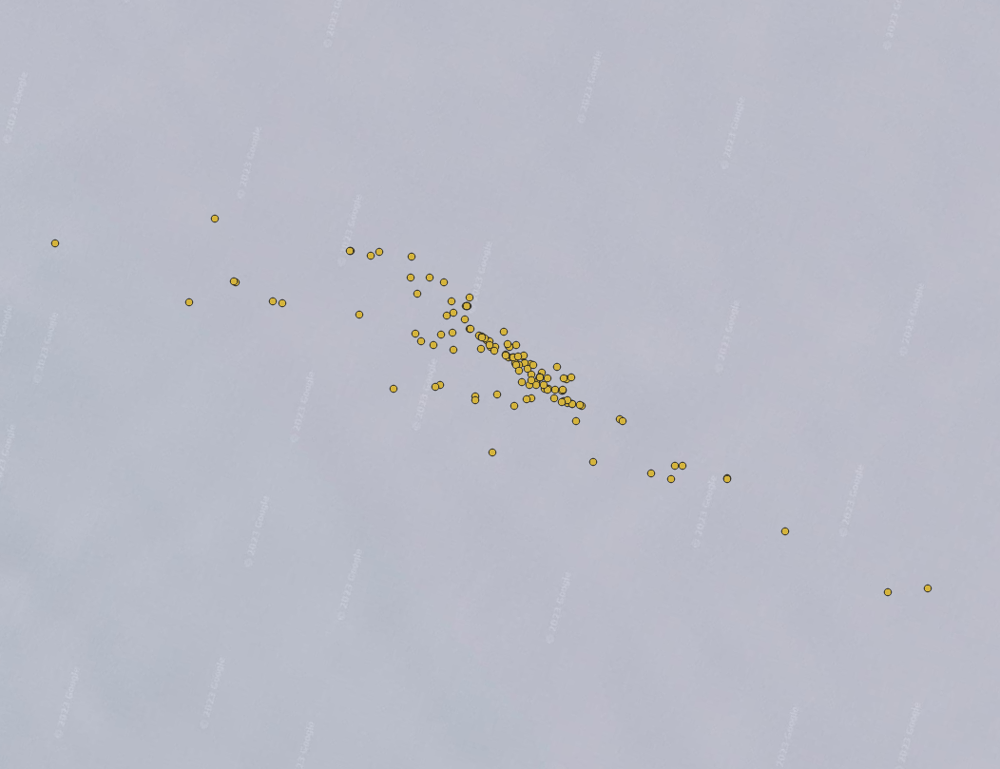
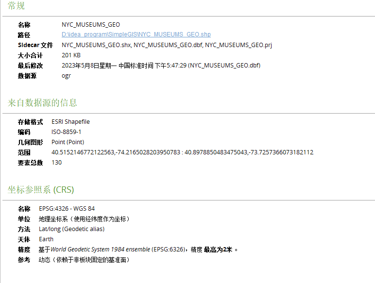
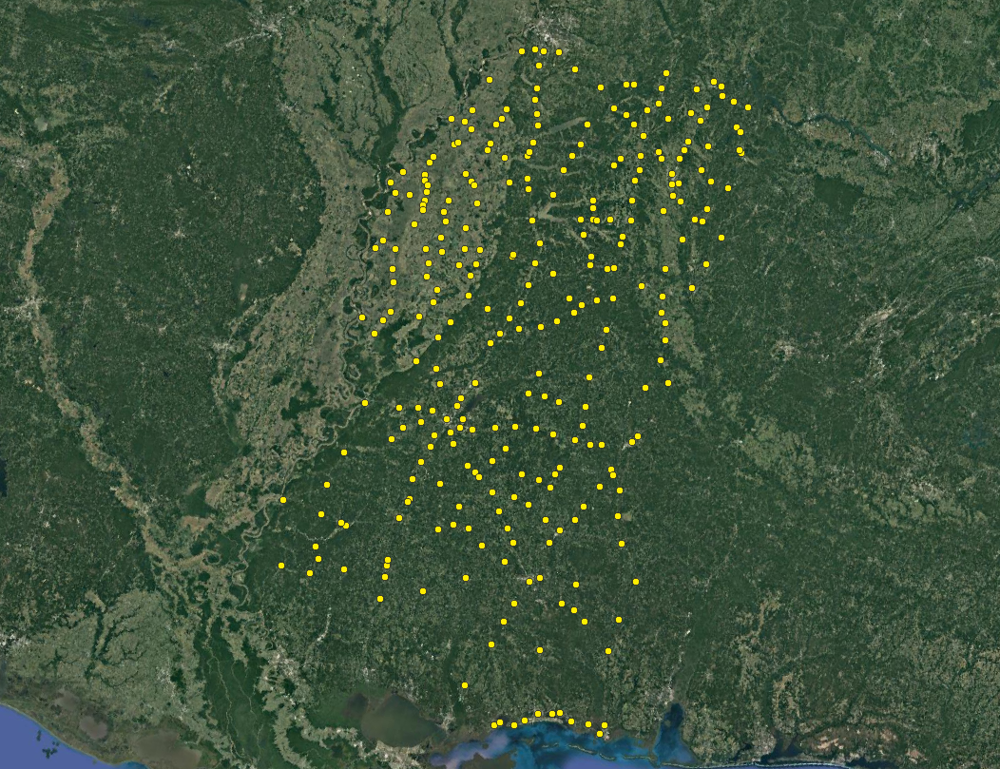

# 距离测量

计算距离时有3种地球模型可供选择：

- 平面
- 球体
- 椭球体

**平面模型**

采用标准的欧几里得几何，地球被当作没有曲率的平面。

地理空间坐标系常用的格式时十进制度数，但是十进制度数坐标是分别根据经纬度和本初子午线、维度线和赤道在地球模型上形成的角度获取的。 此外经度在两极向零度收敛，维度线周长在两极也相应变得更小。

地图投影试图将三维球体转换为地图或者计算机屏幕这样的二维平面来简化这一问题。 地图投影是把地球模型压扁转换成二维平面，并且为了方便制作地图，允许部分失真。
投影过后，十进制度数会被当作包含x和y的笛卡尔直角坐标系统来使用，这样方便使用欧氏几何的勾股定理。

**球体模型**

通过避免将地球平铺到一个平面上从而能够更好地表现地球的实际状态。

该模型使用一个完美的球体来表达地球的特征（和地球物理模型类似），它允许你直接进行度数测量， 忽略了一个事实 —— 地球的形状实际是由薄厚不均的地壳组成的像蛋黄一样的椭球体。

**椭球体模型**

在使用椭球体地球模型过程中，分析师一致尝试找到一个最佳的地表模型。 目前存在多种椭球体地球模型基准，其中一套基准就是一组地球形状定义的集合，也被称为大地测量坐标系统。

和其他地理坐标系统类似，基准也可以对特定区域进行优化，最常用的基准是基于全球的WGS84基准。
在东半球，欧洲地面参照系统更流行，ETRS89基准对欧亚大陆板块做了微调，使用ETRS89基准制作的地图不会受到地壳每年高达2.5cm的大陆板块漂移的影响。

椭球体重心到其表面不存在一个固定的半径，虽然不是完全近似，但是它比正圆形球体模型更符合实际。 另外还有一种模型叫大地水平面模型，它是不受除了重力和自转等因素之外影响的最精准的地球模型。



[距离测量.py](<./距离测量.py>)

## 勾股定理(也叫欧氏距离公式) —— 平面地球模型

a^2^ + b^2^ = c^2^

## 半正失公式 —— 球体地球模型

勾股定理中的十进制度数存在投影误差的原因之一是和大圆距离（球面距离）有关。

**大圆距离**是指球体表面上两点之间最短的距离（根据经度纬度计算两点间的距离）。

一般来说，球面上任意两点A和B以及球心都可以确定唯一的大圆，这个大圆被称为**黎曼圆**，而在大圆上连接这两点的较短的一条弧的长度就是大圆距离。

若这两点和球心正好都在球的直径上，则过这三点可以有无数大圆，但两点之间的弧长都相等，因此该大圆能够将球体等分。



最佳的十进制度数的距离测量方法 —— **半正失公式**

> 半正矢（haversine）在三角函数中，称1/2(1-cos α)为角α的半正矢，记作hav α，即hav α=1/2(1-cos α)

> 半正矢函数为正矢（versed sine）函数乘以1/2，在三角函数中，称1－cos α为角α的正矢，记作vers α， 即vers α=1-cos α


λ：经度 φ：纬度

[半正矢距离计算公式具体推导过程](<https://en.wikipedia.org/wiki/Haversine_formula>)

半正矢公式是最常用的距离计算公式， 因为它相对来说代码量较少并且大部分情况下足够精确，他的精度范围能够控制在1m以内。

> 目前遇到的大部分坐标点都是未经投影变换的十进制度数格式。
> 所以，从距离测量的角度来看，有以下几个可供选择的方案：
> - 重投影到一个精确的笛卡尔坐标系统中进行计算距离
> - 根据精度要求只使用半正失公式
> - 使用精度更高的Vincenty公式

## Vincenty公式 —— 椭球体地球模型

如果使用的是一个本地化的椭球体模型，那么它的计算精度可以远远小于1m， 可以自定义半长轴和扁平率来匹配任何权威的椭球体模型。

[Vincenty公式](<https://en.wikipedia.org/wiki/Vincenty%27s_formulae>)

> [geopy模块](<https://geopy.readthedocs.io/en/latest/>)包含一个Vincenty公式的实现，并且它还支持地理位置编码，能够将地名转换为经纬度坐标。

更进一步了解距离和方位测量知识以及和它们相关的编程算法实现，可以访问[此网址](<http://www.movable-type.co.uk/scripts/latlong.html>)

# 方位计算

除了距离测量外，可能经常会碰到需要知道某直线起点和终点构成的方位信息， 只需要使用math模块根据构成这些直线的点就可以计算出直线的方位朝向。

有时可能会得到一个负的方向值，为了避免这种情况，可以将计算的结果和360相加避免产生负值，使用Python模块的操作符对负值进行360度的周期转换。

[一个交互式的三角函数计算网站](<https://www.mathsisfun.com/sine-cosine-tangent.html>)

# UTM坐标转换

可以使用Python的utm模块对这些数据进行通用横轴墨卡托投影（Universal Transverse Mercator，UTM）和经/纬度之间的转换。

```cmd
pip install utm
```

utm投影是有epsg代号的，也可以使用postgis函数直接转换，epsg代号去[epsg官网](<https://epsg.io/>)查

UTM区域水平方向是根据数字进行编号的，但是竖直方向是根据英文字母编号的，不过其中包含一些特例：

- 字母 A 、 B 、 Y 、 Z 覆盖了两级地区
- 字母 I 和 O 被忽略了，因为他们看起来像0和1
- 字母 N 到 X 包含了北半球
- 字母 C 到 M 包含了南半球



起始分布带为180度，自西向东算起

- 经度分区：编号1-60，其中58个区的东西跨度为 6°
- 纬度分区：编号C-X(不含I,O,共20个区)，每个区的南北跨度为 8°，
- A,B,Y,Z覆盖南极和北极区
- N为第一个北纬带，N之后的字母均为北纬带，N之前的字母均为南纬带



**经度带计算公式（适用于东经）：**

经度带 = [经度/6]取整 + 31

**UTM坐标表示格式：**

UTM坐标的一般形式为：11U 358657mE 5885532mN

- 11 表示位于经度 11 区
- U 表示位于纬度U区
- 358657mE 表示东向位置为358657m
- 5885532mN 表示北向位置为5885532m

**东向位置**

每个经度区均有一条中心经线，如 11 区的经度范围为120W-114W，则其中心经线为117W。

中心经线以东的点到中心经线距离为正，中心经线以西的点到中心经线距离为负。

则某点的东向位置即为该点到中心经线的距离加500,000m。

例如： 中心经线以东8m的点的东向位置为：500,000 + 8 = 500,008m

中心经线以西350m的点的东向位置为：500,000 - 350 = 499,650m

加500,000m的好处是保证一个经度区内的所有点的东向位置均为6位正数。

**北向位置**

北半球北向位置即为该点到赤道的距离。

南半球北向位置为10,000,000m减去该点到赤道的距离。

例如：赤道以北34m的点的北向位置为：34m

赤道以南34m的点的南向位置为：10,000,000 - 34 = 9,999,966m

所有点的北向位置也是正数。

**UTM简写形式**

当特指某一带区时，UTM存在另一种简写形式，例如GR 6525。

GR 表示UTM简写，后面的数字可以为4位、6位或8位整数，数字序列的前一半表示东向位置，后一半表示北向位置。

[UTM坐标转换.py](<./UTM坐标转换.py>)

# 重投影

OGR API是osgeo模块的一部分，其中包含一个开放索引模块——osr，借助这个模块来实现重投影操作






如果需要处理一批点，可以使用[PyProj模块](<https://pypi.org/project/pyproj/>)对他们进行批量重投影

# Shapefile文件编辑

对于shapefile文件的编辑和其他操作，只需要关注两个类型即可：.shp和.dbf文件

.shp文件包含几何图形，.dbf文件包含几何图形相关的属性信息， shapefile文件中的每一条图像记录都会有一条对应的dbf记录信息， 这些记录并没有编号或者以其他方式标记，
也就意味着从shapefile文件中添加或者删除信息时，必须确保相关的文件中也做了相应的修改。



[Shapefile文件编辑.py](<./Shapefile文件编辑.py>)

## Shapefile文件访问

这里使用PyShp库打开shapefile文件。

## Shapefile文件属性读取

dbf文件是一种简单的数据库格式， 它和行列式的电子表格的结构类似，其中每一列通过标签定义了它包含哪些信息。

字段属性返回了丰富的信息，该属性包含了一组描述每个字段相关信息的列表。 对于每个字段来说，它们包含如下描述信息：

- **Field name:** 字段的文本名称，它由10个以内的任意字符构成。
- **Field type:** 字段的类型可以是文本、数字、日期、浮点数以及通过字母C、N、D、F和L表达的布尔值。
  Shapefile文件规范中建议使用的dbf格式是dBASE III，但是目前大部分GIS软件支持dBASE IV。在第四版中，数字型和浮点型是一样的。
- **Field length:** 以字符数或者数字规定了数据的长度。
- **Decimal length:** 规定了数字或者浮点数字段的小数位数

通常第一个字段描述信息是隐藏的，因为它是作为dbf文件格式规范的一部分而存在的。
删除标记允许软件将数据记录标记为已删除状态，但实际上并没有执行删除操作。
通过执行上述操作，信息仍然在文件中，但是不会在记录列表或者查询结果中显示。

大部分GIS分析软件都会假定Shapefile文件中的数据是经过编号的，因为每个GIS程序都这么显示。
但是，假如你删除了一条记录（例如ArcGIS/QGIS中编号为5的一条记录），并保存了该文件之后，
当再次打开该文件时，会发现之前编号为6的记录变成编号5了。

某些空间数据库会为每条记录分配一个唯一标识符。可以在dbf文件中添加一个字典从而建立你自己的编号系统，这样一来，即使记录被删除，相应的编号也不会发生变化。

## Shapefile文件几何图形读取

在每个几何图形（形状）记录中，点都是存放在一个名为 "点集" 的列表中，即使只包含一个点也是如此。
点是由x,y坐标对构成的，如果采用了地理坐标系统，那么纬度是在经度之前排列的。

Shapefile文件规范还支持三维几何图形，高程数据通常使用z轴表示，一般称其为z值。
如果几何形状类型不支持z值，那么PyShp库在访问该文件是将不会读取该属性。
Shapefile文件在包含z值的同时，也可能包含一个名为m的测量值，该测量值可能是和上述形状有关的用户自定义信息（这种形状数据一般被叫做M型几何图形）。
z值和m值很少见。

## Shapefile文件修改

当使用PyShp库创建一个读取器对象后，它是只读的，不会对原文件中的记录产生影响。
创建一个Shapefile文件，需要创建一个写对象，可以随意修改数据记录的值。
PyShp库能自动处理元数据信息，只需关注几何图形和属性。
但是这个方法只适用于UTM投影。

## Shapefile文件合并

将同一类型的多个相关的Shapefile文件聚合成一个更大的Shapefile文件。

使用PyShp库处理特定软件生成的dbf文件时偶尔会报错，幸运的是PyShp库允许你单独操作不同类型的Shapefile文件。
可以使用PyShp库处理shp和shx文件的同时，使用dbfPy处理更复杂的dbf文件。

## Shapefile文件分割

有时候需要从比较大的Shapefile文件中分割出特定的子文件，以便将重点放在感兴趣的部分。

PyShp库包含一个支持正负符号的方法，能够接收一组坐标并返回一个带符号的区域。

