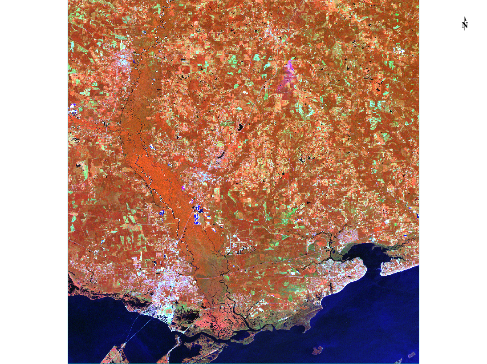
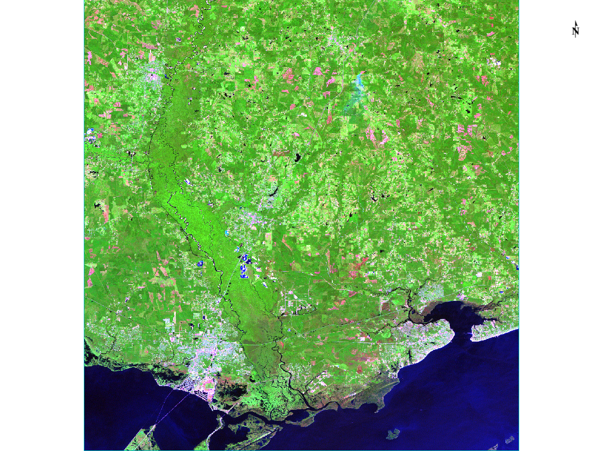
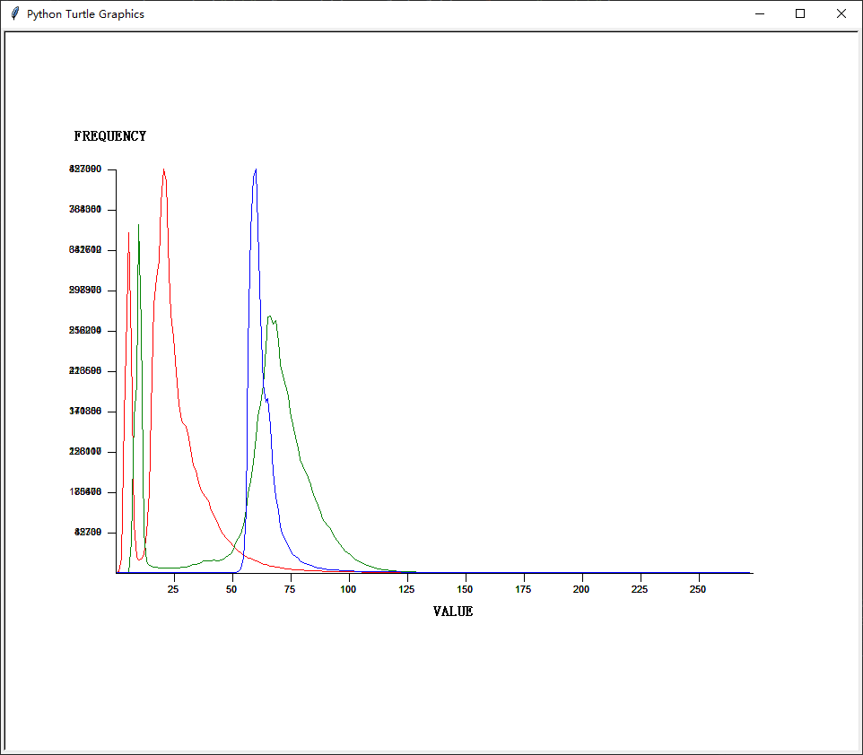
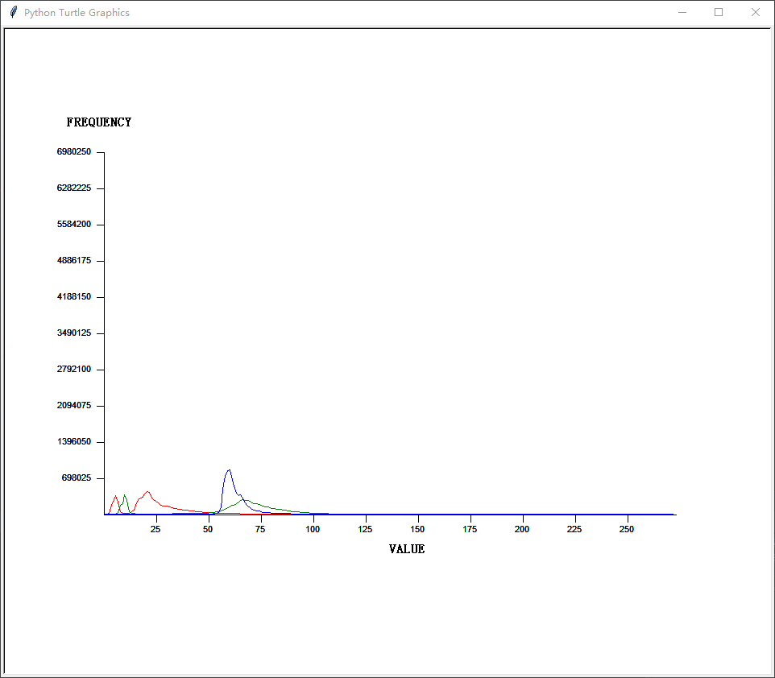
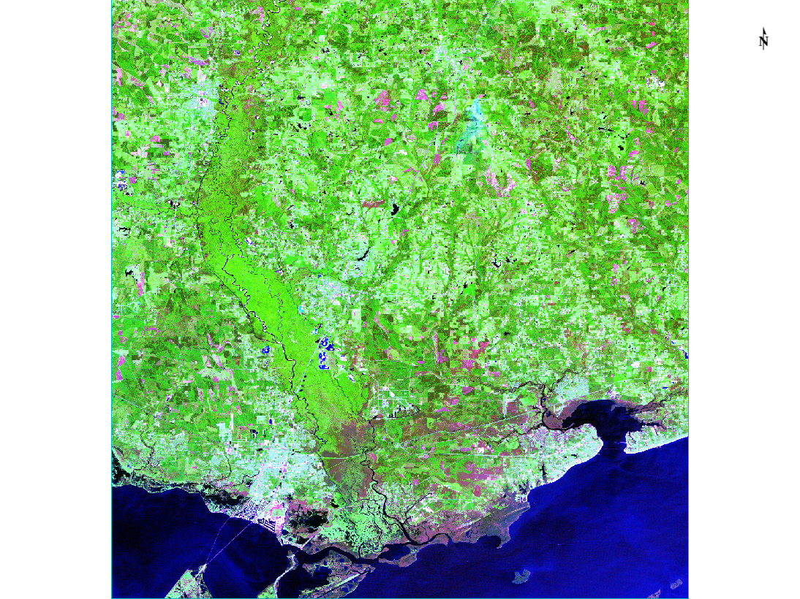
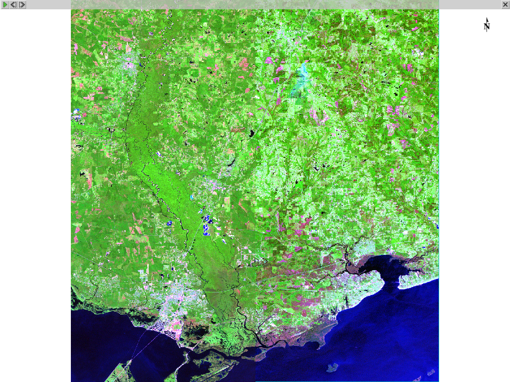
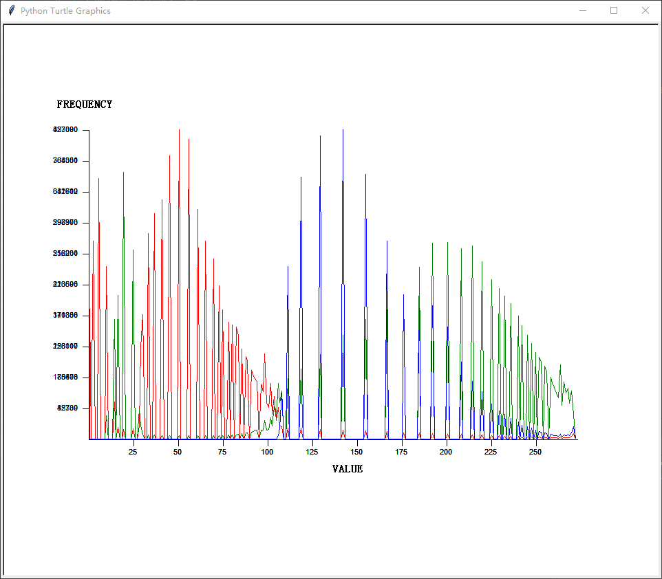

# 图像波段变换

人眼能识别的颜色是由红绿蓝三种可见光谱组合而成的。
航天和航空传感器能够收集波长在可见光范围之外的光谱信息。
为了能够看到这些信息，将调整图像上不同波长的光反射比例的RBG通道来生成彩色图像。
[【参考】](<https://github.com/hanke-janson/GIS/tree/master/ENVI>)

GDAL库包含一个名为gdal_array模块，可以载入和保存遥感影像，方便NumPy库进行数组操作。

打开原图可以看到，植被明显呈现红色（植被在绿光波段反射率高，而图像将绿光波段放到了红色通道），说明该图为假彩色影像。

将波段1和波段2转换后的图像

# 创建直方图

直方图可以显示一个数据集中数据分布频率的统计结果。
在遥感领域，数据集就是图片。
其中的数据分布就是区间在0~255之间的像素数出现的次数。
上述区间表示计算机存储图像信息采用的是8字节。

在RGB图形中，颜色是由数字组成的3位元组表达的，其中(0,0,0)代表黑色，(255,255,255)代表白色。

可以为一幅图片生成直方图，其中竖直方向y轴代表频率值，水平方向x轴代表区间中256种像素值。

直方图一般是通过给定宽度的柱状图表示分组数据大小的，但对于一张图片来说，每一个数据只有一个值，所以将会用一条线表示它。

swap.tif的直方图

如图所见，3给波段的分布全部都紧靠着图形的左边，并且他们的值都小于125，因为这些值离零轴比较近，所以图片看上去色调偏暗。

swap.tif以绝对比例生成的直方图

上述结果难以查看数据分布的细节，但是如果希望比较相同图片生成的不同直方图之间的差异，那么绝对比例生成的直方图在这方面是很有用的。

## 直方图均衡化

直方图均衡化会根据全局对比度重新分配像素值的分布。这样我们就可以获得更多高强度的值，并且图片亮度更亮了。

经过直方图均衡化后的影像

为了直观的展示直方图均衡化前后的影像变化，这里使用ENVI中的view swipe功能，左边显示的是未均衡化的影像，右边显示的是均衡化后的影像

重新运行绘制直方图的代码，从结果中可以看到，三个波段的DN值不再明显偏小，而是相对均匀一些。

# 图像剪裁

