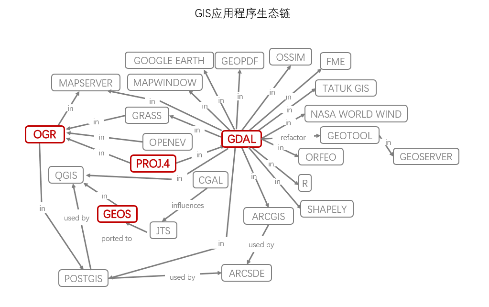

# Python 地理空间分析指南（第二版）杂记

[开源软件项目网站](<https://sourceforge.net/>)

开源矢量库([OGR](<http://www.gdal.org/ogr_formats.html>))支持超过86种矢量格式

安全软件特征操作引擎([Feature Manipulation Engine, FME](<http://www.safe.com/fme/format-search/#filters%5B%5D=VECTOR>))
支持超过188种矢量格式

[空间参考网站](<https://spatialreference.org/ref/>)

开源栅格库-地理空间数据抽象库([GDAL](<https://gdal.org/drivers/raster/index.html>))支持超过130种栅格格式

TIFF 格式支持的压缩算法包括 Lempel-Ziv-Welch 算法，不适用于遥感处理过程，压缩过的图片主要是用来正确显示图片的，但是其原始单位信息经常会被修改

JPEG格式是一种为了减小文件体积而舍弃部分数据的有损格式

在python中世界文件搭配栅格数据使用，通常世界文件被当作地理参照文件使用

[世界文件参考](<http://kralidis.ca/gis/worldfile.htm>)

Web服务：WMS WFS ...

## 地理空间技术概览

一般来说，地理空间数据软件包从不同程度上实现了下列4种高级核心功能的一种或多种：

- 数据访问
- 几何计算（包含数据重投影）
- 可视化
- 元数据工具

另一个重要类别是遥感影像处理，很零散，包含几十个软件功能包

- 开源软件影像地图（Open Source Software Image Map, OSSIM）
- 地理资源分析支持系统（Geographic Resource Analysis Support System, GRASS）
- Orfeo工具箱（Orfeo ToolBox, OTB）
- ERDAS影像
- ENVI

[维基百科的GIS软件列表](<https://en.wikipedia.org/wiki/Geographic_information_system_software>)

### 数据访问

#### GDAL

地理空间数据抽象库(The Geospatial Data Abstraction Library, GDAL)

GDAL的[主页](<https://gdal.org/>)

#### OGR

OGR简单特征库是GDAL库处理矢量数据的搭档

主要用途是处理矢量数据

特性：

- 统一的矢量数据格式和抽象建模
- 矢量数据重投影
- 矢量数据格式转换
- 属性数据过滤
- 基本的几何图形过滤，包括剪切，点包容性测试等

>当使用OGR访问Shapefile文件时，在打开数据源后，必须再调用一个新的图层对象，并且该对象的的名字必须使用Shapefile文件不带扩展名的文件名

### 计算几何

计算几何主要包含处理矢量数据所需的算法

#### PROJ.4投影库

[更多信息](<https://github.com/hanke-janson/GIS/tree/master/proj>)

#### CGAL

计算几何算法库(The Computational Geometry Algorithms Library, CGAL)

[主页](<https://www.cgal.org/>)

例如：一种常见的多边形直骨架算法 —— 用于精确的扩张或者收缩一个多边形

#### JTS

Java拓扑套件是地理空间计算几何库，实现了SQL的开放地理空间联盟(OGC)简单要素标准

JTS Test Builder

#### GEOS

开源几何引擎(Geometry Engine-Open Source, GEOS)是JTS库的C++版实现

[更多信息](<https://trac.osgeo.org/geos>)

#### PostGIS

PostgresSQL的一个模块，PostGIS大部分强力特性都是GEOS库提供的。

在架构层面使用OGC的ST(Spatial Type)命名约定区分空间函数和普通的关系型函数，例如：ST_Buffer()

[更多信息](<https://github.com/hanke-janson/GIS/blob/master/PostGIS.md>)

#### 其他支持空间分析的数据库

- [Oracle Spatial and Graph](<https://www.oracle.com/database/spatial>) (昂贵、高扩展)
- [ArcSDE](<https://www.esri.com/software/arcgis/arcsde>) (主要被用来当作Esri软件的数据源来使用)
- Microsoft SQL Server (不如postGIS和Oracle Spatial)
- [MySQL](<https://dev.mysql.com/doc/refman/5.7/en/spatial-types.html>) (地理空间分析的优势不明显)

#### SpatiaLite

SQLite采用文件系统并且主要用来替代一般的使用关系型数据库服务器的客户端/服务端模式和应用交互

SpatiaLite添加了对OGC简单要素服务和地图投影的支持

[详细信息](<https://www.gaia-gis.it/gaia-sins/>) (开源数据库引擎SQLite的扩展)

#### 路径分析

路径分析是几何非常擅长的领域，一个路径算法主要的任务是简化一个网络数据集和计算出影响遍历网络速度的阻抗值。通常这两个数据集都是矢量数据，但在特定应用中也会用到栅格数据。

该领域主要有两个竞争对手，[Esri的网络分析产品](<https://www.esri.com/en-us/arcgis/products/arcgis-network-analyst/overview>)和[PostGIS的开源pgRouting引擎](<http://pgrouting.org/>)。

最常见的路径问题是访问若干位置点的最佳方式 —— 旅行商问题(travelling salesman problem, TSP)

[TSP问题](<https://en.wikipedia.org/wiki/Travelling_salesman_problem>)常常被当作其他路径算法的基准。

### 桌面工具(包括可视化)

#### Quantum GIS (QGIS)

#### OpenEV 

最快的栅格数据查看器之一，支持GDAL/OGR和PROJ.4库的所有功能

#### GRASS GIS

#### uDig

java实现的GIS查看器软件，基于Eclipse构建，主要用作Web服务(例如 WMS 和 WFS)和常见数据的富客户端查看器，与GRASS GIS相关的java版程序叫JGRASS

#### gvSIG

另一款java实现的桌面GIS应用软件

#### OpenJUMP

使用java开发的开源桌面GIS应用软件

#### 谷歌地球

使用KML(Keyhole Markup Language)

#### NASA World Wind

一款开源、虚拟地球的地理空间查看软件

#### ArcGIS

### 元数据管理

OGC的元数据管理标准是互联网目录服务(Catalog Service for the Web, CSW)，它创建了一套基于元数据的目录系统以及一组发布和发现数据集的API

#### GeoNetwork

开源，使用java实现的管理地理空间数据的目录服务

[官网](<https://www.geonetwork-opensource.org/>)

#### CatMDEdit

使用java编写的元数据编辑器

## Python的地理空间分析工具

[这个网站](<https://pypi.org/>)为Python功能包大全PyPI

[这个网站](<https://www.lfd.uci.edu/~gohlke/pythonlibs/#gdal>)包含几乎所有Python版的开源科学计算功能库的windows二进制发行包

[这个网站](<https://lxml.de/performance.html>)为评估不同的Python XML解析器在内存效率和速度方面提供了一个分析参考

[这个网站](<https://www.w3schools.com/xml/xpath_intro.asp>)为XPath的一些信息

[这个网站](<https://shapely.readthedocs.io/en/latest/index.html>)是shapely的文档

[这个网站](<https://pillow.readthedocs.io/en/latest/index.html>)是Pillow的文档

[这个网站](<http://www.spectralpython.net/>)是SPY的官网

[第三方模块.py](<./第三方模块.py>)

## Python 与地理信息系统

[python与地理信息系统.md](<./Python与地理信息系统.md>)

## Python 与遥感

[Python与遥感.md](./Python与遥感.md)
